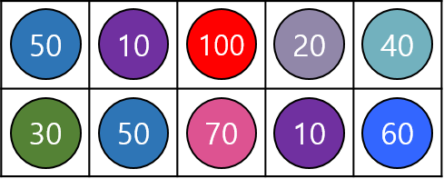

# Sushi

초밥을 좋아하는 현진이는 초밥 시식회에 참석했다. 초밥은 위 그림과 같이 2 X N 접시들에 담겨서 나온다.  
각 초밥에는 가격이 적혀 있는데, 비싼 입장료를 지불한 현진이는 최대한 뽕을 뽑으려고 한다.  

문제는 이 시식회에는 특별한 룰이 있는데, 초밥 하나를 시식하면 그 초밥의 위, 아래, 왼쪽, 오른쪽에 있는 초밥은 시식할 수 없다는 것이다.

예제로, 위 그림은 가격이 50, 50, 100, 60인 초밥들을 시식하면 총 가격 260으로 최대한 비싸게 시식할 수 있다.  
참고로, 가장 비싼 두 초밥(70, 100)은 붙어있기 때문에 동시에 시식할 수 없다.

현진이가 최대한 비싸게 시식하는 것을 도와주자.

## Input

첫 번째 줄에 총 테스트의 개수 T 가 입력된다. 각 테스트는 다음과 같은 입력으로 구성된다.  
먼저 N (1 ≤ N ≤ 100,000) 이 주어진다.  
다음 두 줄에는 N 개의 정수가 주어지며, 각 정수는 그 위치에 해당하는 초밥의 가격이다.  
초밥의 가격은 200을 넘지 않는다.

## Output

T 개의 줄에 각 테스트마다 시식할 수 있는 초밥 가격의 최대값을 출력한다.

## Sample Input

3  
5  
50 10 100 20 40  
30 50 70 10 60  
8  
10 20 10 40 50 20 90 80  
40 40 70 80 20 50 40 90  
10  
50 20 10 10 100 40 20 60 90 80  
40 50 100 20 90 20 40 50 50 70

## Sample Output

260  
420  
530

## Source
